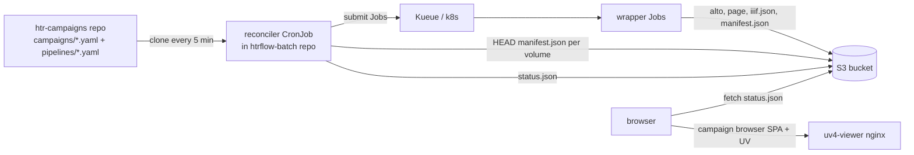

# Campaign GitOps: git-driven batch submission + read-only status page

**Date:** 2026-07-29
**Status:** Draft — pending review
**Depends on:** htrflow-batch wrapper (as of `cc0f109`), Helm chart `charts/htrflow-batch`, Kueue queue `htr-batch`, RustFS results bucket

## 1. Problem

Running one volume today means hand-writing a Job manifest and `kubectl apply`.
For campaigns of hundreds to thousands of volumes we need:

- a place to declare *what should be transcribed* (auditable, reviewable),
- something that submits the missing work and retries transient failures,
- a way to see status across all batches and open any volume in the viewer —
  both untranscribed (source images) and transcribed (with text overlay).

Explicitly rejected: a database as source of truth (S3 already proves "done";
k8s already shows "running"), and any interactive submit UI (two write paths
destroy auditability).

## 2. Architecture

Three pieces; only the reconciler is new code.



- **Desired state** lives in git (`htr-campaigns` repo).
- **Observed state** is derived: `manifest.json` in S3 = done (immutable,
  published only after full verify); Job in cluster = queued/running/failed;
  in git but neither = pending.
- **The page never writes.** Adding work = a commit. The reconciler is the
  only component with k8s credentials.

## 3. The campaigns repo (`htr-campaigns`, separate from htrflow-batch)

Separate repo because operations and code change at different rhythms, and PR
review stays legible ("new campaign" vs "new feature").

```
campaigns/
  trolldomskommissionen.yaml
pipelines/
  demo-v1.yaml          # htrflow steps YAML, verbatim
```

### Campaign file

```yaml
# campaigns/trolldomskommissionen.yaml
pipeline: demo-v1        # one pipeline per campaign (see immutability, §5)
volumes:
  - R0001203                       # shorthand: Riksarkivet ref ->
                                   #   https://lbiiif.riksarkivet.se/arkis!<ref>/manifest
  - id: dodsbok-1698               # any IIIF Presentation 3 manifest on the web
    manifest: https://iiif.example.org/xyz/manifest
  - id: loose-scans                # bare image URLs -> reconciler generates a
    images:                        #   synthetic P3 manifest in the bucket
      - https://example.org/scan1.jpg
      - https://example.org/scan2.jpg
```

Rules:

- `id` (or the ref itself for shorthand) must be unique within the pipeline
  and filesystem/S3-key safe: it becomes the S3 prefix
  `<pipeline>/<id>/` and the viewer URL.
- No per-volume pipeline overrides. A volume needing different treatment goes
  in its own campaign file. Every override is reconciler complexity we defer
  until proven necessary (YAGNI).
- Re-running a campaign with a changed pipeline = a **new** pipeline id and a
  new campaign file. Old results stay untouched and comparable side by side
  (`demo-v1/R0001203` vs `demo-v2/R0001203` in the viewer).

### Pipeline files and immutability (D17 carried over)

A pipeline id names the **full recipe**: the htrflow steps *and* the exact
wrapper image that runs them. Without the image pin, two volumes under the
same prefix could be produced by different htrflow builds — silently
breaking the comparability that immutability exists to protect.

```yaml
# pipelines/demo-v1.yaml
image: docker.io/riksarkivet/htrflow-batch@sha256:5d5c60...   # digest, REQUIRED
steps:
  - step: Segmentation
    ...
```

- `image` must be digest-pinned (`@sha256:`); tags are mutable and are
  rejected by the reconciler. (`docker inspect --format
  '{{index .RepoDigests 0}}'` after a push yields the pin.)
- The reconciler sets the Job's container image from this field and passes
  it as `IMAGE_DIGEST` env, which the wrapper already stamps into every
  published `manifest.json` — closing the provenance chain
  (git recipe → Job → results). Today that field reads "unknown".
- The ConfigMap contains only the `steps:` document (what htrflow parses);
  the wrapper's recorded `pipeline_sha256` therefore covers the steps, and
  `image_digest` covers the image — the drift checks below verify both.
- Honest limit: this pins our code, not the world. Model weights are pulled
  from Hugging Face at runtime; unless each step pins a model `revision`,
  upstream model updates can still change output under the same pipeline id
  (the shared HF cache PVC makes this stable in practice, not in principle).
  Recommended for campaigns that must be reproducible: pin revisions in the
  steps. GPU nondeterminism means bit-identical reruns are out of scope
  regardless.

Results are keyed by pipeline id, so `pipelines/<id>.yaml` is immutable once
any result exists under that id. Guards (all three, layered):

1. **CI check in htr-campaigns**: PR fails if an existing `pipelines/*.yaml`
   is modified — new ids only. (Guards PRs, not direct pushes → repo must
   have a protected default branch, §8.)
2. **Reconciler drift check**: before submitting, compare the steps
   document's SHA-256 with the existing `htr-pipeline-<id>` ConfigMap.
   Mismatch = hard error, nothing submitted for that pipeline, loud line on
   the status page.
3. **S3 ground-truth check (v1, not deferred)**: also compare the steps
   SHA-256 **and the image digest** against `pipeline_sha256` /
   `image_digest` recorded in one already-published `manifest.json` under
   that pipeline prefix. This is the check that actually protects results —
   the ConfigMap check fails open if the ConfigMap was deleted (e.g. chart
   reinstall). Costs one GET per pipeline per tick.

## 4. The reconciler

~200 lines of Python, lives in the **htrflow-batch** repo as
`packages/reconciler/` — the repo becomes a uv **workspace** (ra-mcp layout:
root `pyproject.toml` with `members = ["packages/*"]`, single root `uv.lock`,
wrapper moved to `packages/wrapper/`), and both packages follow the
AI-Riksarkivet/ra-skills house style (Pydantic models, ruff, ty). The
reconciler is tested and shipped like the wrapper (same image or a
thin variant). Runs as a k8s **CronJob every 5 minutes**.

Per tick:

1. Clone/pull the campaigns repo (shallow; HTTPS with the public CAs in the
   image — corp bundle mount required on intercepted egress, §7.1).
2. Parse campaign + pipeline files. A malformed file is skipped and reported
   on the page as broken; other campaigns proceed.
3. Ensure `htr-pipeline-<id>` ConfigMaps (immutability guards, §3).
4. Pre-validate non-shorthand volumes once: fetch the manifest and classify
   it. P2 and P3 are both submittable (the wrapper parses both, §8);
   anything else — a Collection, junk, or an unreachable host → status
   `unsupported` / `unreachable` on the page, no job burned. Verdicts about
   the *document* are cached in the bucket so classification is once, not
   per tick; `unreachable` is a verdict about the *network* and is
   deliberately never cached, so one flaky fetch cannot wedge a volume out
   of its campaign permanently.
5. For `images:` volumes: generate the synthetic P3 manifest (reuse
   `scripts/make_mock_manifest.py` logic) and upload to
   `sources/<pipeline>/<id>/manifest.json` if absent.
6. Derive status per volume (see table §6).
7. Submit pending volumes up to a bounded window (default: 20 not-yet-done
   Jobs existing at once), **round-robin across campaigns** so a 4,000-volume
   campaign cannot starve a 10-volume one.
8. Retry policy: transient failures (exit 1) resubmitted up to 3 attempts —
   resume makes this cheap; permanent failures (exit 13) and exhausted
   retries marked `needs-attention`, never auto-resubmitted. Before a failed
   Job is TTL-reaped, capture its last ~50 log lines into
   `status/failures/<pipeline>/<id>.txt` (closes today's evidence-evaporation
   gap: the R0001203 run's first-attempt metrics died with the pod).
9. Write `status/status.json` to the bucket (the campaign-browser SPA — §5 —
   renders it; the reconciler generates no HTML).
10. Update `status/attempts.json` (attempt counts). The only non-derivable
    state; losing it merely causes a few redundant retries (capped).

Concurrency safety: `concurrencyPolicy: Forbid` (no overlapping ticks) plus
deterministic Job names `htr-<pipeline>-<volume-id>-<8-hex-digest>` (the
digest over the pair disambiguates ids that flatten to the same slug, and
keeps the name DNS-1123-safe) so a duplicate create is a harmless
AlreadyExists. Job spec is the same shape as today's (Kueue queue
label, `suspend: true`, GPU request, `RESUME=true`, secret envFrom), with the
container image and `IMAGE_DIGEST` env taken from the pipeline file's pin —
the chart's default wrapper image applies only to chart-managed example Jobs,
never to campaign Jobs.

RBAC: a ServiceAccount allowed to create/get/list Jobs and ConfigMaps in the
`htr-batch` namespace, nothing cluster-scoped.

Chart: new `reconciler:` values block (enabled flag, campaigns repo URL,
schedule, window size, attempt cap) rendering the CronJob + RBAC. The chart's
existing `pipelines:` map remains for chart-only standalone use; the GitOps
path owns pipelines in the campaigns repo.

## 5. Status page: the campaign browser

A **Svelte SPA, built with Bun** (same stack as rask, one frontend idiom
across projects), compiled to static files and **served by the `uv4-viewer`
nginx at `http://<host>:30800/`** — the viewer's front door, replacing
today's hardcoded redirect to a single manifest. Bun/Svelte are build-time
only: no server runtime, no auth, read-only by construction. The app fetches
`status/status.json` from the bucket (public-read object; reconciler
regenerates it every tick) and renders everything client-side.

Three levels of navigation:

1. **Campaign list** — every campaign from git, progress bar (done/total),
   drift and broken-file warnings, `generated at` stamp.
2. **Campaign view** — volumes as a grid: first-page thumbnail (straight
   from the source IIIF service via `full/200,`, no extra storage), status
   chip (pending / queued / running / done / needs-attention), pages
   done/total, wall time, attempts, error summary for failures.
3. **Volume click → opens UV** (`uv.html#?manifest=...`, same origin):
   - done → the published manifest (`.../iiif.json`) — all images **plus**
     text panel and line overlays;
   - pending/queued/running/failed → the *source* manifest — all images,
     browsable in UV's gallery view, no transcription yet.

   One viewer serves both states; a volume silently "upgrades" to
   transcribed the next time it is opened after its run completes.

Image browsing is deliberately delegated to UV — the page finds and ranks
batches; UV looks at them.

Freshness: the app compares `status.json`'s `generated_at` to now and shows
a visible **STALE** banner when older than 3× the tick interval — a dead
reconciler must not look like "no news" (§7.1).

Build/ship: `frontend/` directory in the htrflow-batch repo; a dagger
function builds it (bun install/build, CA-bundle wiring like the existing
node builds — RA firewall) and the viewer image copies `dist/` in next to
`uv.html`. UI changes therefore mean rebuilding the `uv4` image —
reproducible via `dagger call build-viewer`. Dev loop: `bun run dev`
against a checked-in `status.sample.json` fixture (note: bind non-loopback
explicitly if testing over the LAN, as with rask's dev server).

## 6. Status derivation (the three-way join)

| manifest.json in S3 | Job in cluster | in git | status |
|---|---|---|---|
| yes | — | yes | **done** (immutable; cached, never re-checked) |
| no | Workload not admitted | yes | **queued** |
| no | pod running | yes | **running** |
| no | Job failed (pre-TTL) | yes | **failed** (exit 1 → retry; 13 → needs-attention) |
| no | none | yes | **pending** (or retry-eligible per attempts.json) |
| yes | — | no | **orphan** — listed, flagged, never deleted (removal from git stops future work; it never destroys results) |

## 7. Known issues, accepted trade-offs

1. **Silent reconciler death** — the liveness of everything rides on a
   CronJob cloning GitHub through the RA firewall. Mitigated (public CAs in
   image; corp bundle mount required on intercepted egress — future
   `extraCaSecret` value — STALE banner, CronJob failure count surfaced on the
   page via last successful tick timestamp) but *not alerted* — real alerting
   is out of scope until there is somewhere to send it.
2. **Campaigns repo write access ≈ code execution in the job pod.** Pipeline
   YAML selects arbitrary HF model repos; model loading is a known
   code-execution surface. The pod has GPU, egress, and S3 write (but a fixed
   image, no cluster credentials, own namespace). Treat the repo like CI
   config: protected main branch, required review. Model allowlisting is a
   possible future hardening.
3. **Results are a single unreplicated PVC on one node.** Git is durably
   hosted; the bucket is not backed up. Losing that disk = recomputing every
   campaign. Acceptable for PoC; must be restated before anyone treats the
   bucket as an archive.
4. **Wild-web volumes fail in ways we can't tune** — hotlink blocks, auth
   walls, per-host flakiness for `images:` URLs. Pre-validation (§4.4)
   converts the common cases into early, cheap, visible failures.
   Empirically verified 2026-07-29 (LoC Lincoln papers, pipeline
   `english-v1`, volume `loc-mal2459400`): LoC's Presentation manifest is
   bot-blocked (403) while its Image API is open — the synthetic-manifest
   path handled it end to end. Two hard-won details for the reconciler's
   generator: embedded version-2 image services MUST use v2-style keys
   (`@id`/`@type: ImageService2` + `profile`), or UV silently shows no
   image; and this LoC run is the designated plumbing test (English TrOCR
   `microsoft/trocr-large-handwritten`, results under `english-v1/`).
5. **RA firewall blocks most external IIIF hosts** from the cluster —
   including every Swedish-content source (Alvin, manuscripta.se, KB,
   Finna). Reachable: loc.gov/tile.loc.gov, iiif.bodleian.ox.ac.uk.
   Testing on Swedish handwritten letters from non-RA sources requires an
   IT allowlist request (alvin-portal.org, manuscripta.se first).
6. **5-minute staleness** on the page — invisible at 30-min volume
   timescales; revisit only if a long-running operator becomes justified.
7. **A permanently-failed volume has no declarative "skip"** — the remedy is
   deleting it from the campaign file (auditable via git history). Acceptable.

## 8. Out of scope for v1

- ~~IIIF Presentation 2 parsing~~ — **pulled into v1** after first contact
  with the real world: of the external IIIF sources reachable through the
  RA firewall, the usable one (Bodleian) is P2, and LoC's P3-era manifests
  are bot-blocked. Well-contained change in `iiif.py` + reconciler
  pre-validation.
- Catalog/NAD search UI ("browse all of Riksarkivet from the page") — the
  end goal; layers on top of this design without changing it.
- Any write path from the page; multi-cluster; alerting; model allowlists.

## 9. Testing

- Reconciler logic = pure functions over three inputs (parsed git tree, S3
  listing, Job list) → unit tests with fakes, same style as the wrapper
  suite; runs in existing `dagger call test` unchanged.
- Status derivation table (§6) tested case by case, including the orphan and
  drift rows.
- One compose-stack smoke: seed a fake campaign dir + bucket, run one
  reconciler tick, assert submitted Job set + generated `status.json`.
- Frontend: unit tests for status→view derivation (bun test) against
  `status.sample.json`; rendering verified in the compose smoke with the
  built SPA served by the viewer container.
- CI guard in htr-campaigns tested by fixture PRs (modified pipeline → fail).

## 10. Alternatives considered

- **Long-running operator** — second-level freshness, but a service to
  babysit; wrong trade at 30-minute volume durations.
- **GitHub Actions as reconciler** — cluster is unreachable from GH runners
  (firewall), credentials would live outside, and it cannot see S3 state.
- **Database as source of truth** — inverts the design: a lost DB would mean
  a lost campaign, and DB-vs-reality drift becomes a bug class. Derived
  state + git needs neither backup nor migration.
