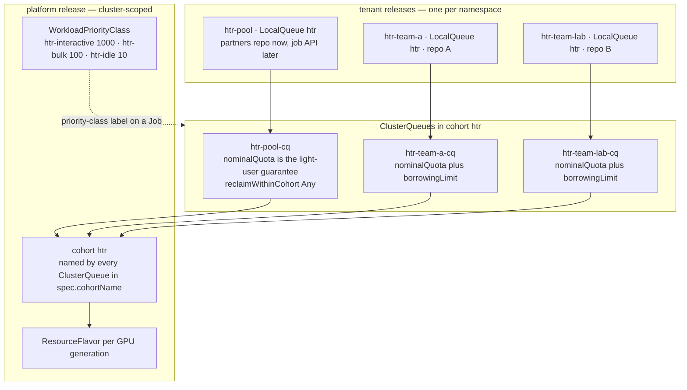
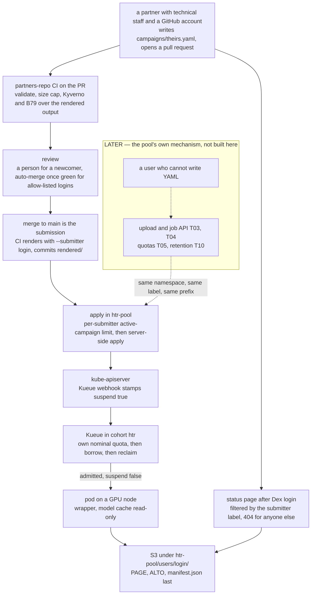

# Multi-tenant htrflow-batch — design (many nodes, many users)

Status: premise taken by the product owner 2026-09-08, pool mechanism settled the same day
(the job API, later; partner submission via git, now) · **extends** `2026-09-01-indexed-jobs-design.md`
(campaigns are Indexed Jobs), it does not supersede it. What that spec decided
about the Job, the ConfigMap, the converter and the wrapper stands; this one
decides who the Jobs belong to and how the GPUs are divided between them.

## 1. Goal and the premise

Recorded verbatim:

> The system must support **many nodes and many users, most of whom have little
> work**.
>
> Shape agreed: **TWO TIERS**. Tier 1 "team tenants" for the few heavy users:
> one Kubernetes namespace = one campaigns repo = one LocalQueue + one
> ClusterQueue with a nominal quota, own RBAC/NetworkPolicy/S3 prefix/apply
> identity. Tier 2 "the shared pool" for everyone else: ONE namespace, ONE
> queue, no repo and no per-user Kubernetes objects; users are told apart by
> identity (from B67's login, Dex + oauth2-proxy) […]; the status page filters
> by that label after login; fairness INSIDE the pool is not Kueue's job.
> BETWEEN tiers Kueue does its job: the pool queue and every team queue in ONE
> cohort with nominal quotas, borrowing when others are idle, fair sharing /
> preemption when not, so the pool's nominal quota guarantees light users are
> never starved.

Settled the same day, after a second look: **the pool has two front doors**,
and both lead into the same namespace, the same queue, the same submitter label
and the same per-submitter prefix.

> **Partner submission via git — built now.** A partner with technical staff —
> another archive, a university lab, a project partner — submits campaigns as
> pull requests to a shared **partners' campaigns repo** on GitHub. CI
> validates, renders and policy-checks; a maintainer merges (auto-merge for
> allow-listed partners); the submitter is recorded by CI, stamped on the Job
> and filtered on after login.
>
> **The upload/job API — later.** T03, T04, T05 and T10 are the pool's other
> front door, for people who cannot write YAML. This design does not build
> them, and **until they exist the pool takes no work from non-git users**.

Also from the first decision: GPU sharing is **nominal quotas with borrowing and
preemption**, not strict partitions; the model cache is **one shared
read-write-many volume** (models are never in the image — standing ruling); a
real registry (**B36**) and results on the HCP (**B10**) are prerequisites;
campaigns get a **size cap per Job**; **priority classes are rendered** (B18).

**Today** the system is single-tenant by construction: one release namespace, one
`ResourceFlavor`/`ClusterQueue`/`LocalQueue` from `queue.*`
(`charts/htrflow-batch/templates/kueue.yaml`), one S3 prefix (`S3_PREFIX =
"<namespace>/"`, `packages/converter/src/htrflow_converter/render.py:223`), one
read-only namespaced `Role` for the web front (`templates/web.yaml`), no login.

## 2. Decisions

| # | Decision | Why, and what was rejected |
|---|---|---|
| D1 | **The tenancy unit differs per tier.** A **team tenant** is one namespace: one campaigns repo, one LocalQueue, one ClusterQueue with its own nominal quota, own RBAC, NetworkPolicies, S3 credentials and prefix, own apply identity. **The pool** is one namespace `htr-pool` with one LocalQueue, one ClusterQueue and **no Kubernetes object per user** — a submitter exists only as a label value on a Job and a prefix in the bucket (D10 and D11 say what those are). | Kueue's guidance that "a namespace is typically assigned to a tenant"[^lq] is right for teams and absurd for a hundred people with fifteen pages each. *Rejected:* a namespace per user — a LocalQueue, Role, RoleBinding, NetworkPolicy, Secret and ClusterQueue each, and a cohort whose member count is the user count. Also rejected: pool-only, since an archive-scale campaign (B16) needs its own repo, review gate (B11) and credentials (B17). |
| D2 | **One cohort, one ClusterQueue per tenant.** Every ClusterQueue sets `cohortName: htr` (the v1beta2 field name, verified against the live CRD); queues in one cohort borrow each other's unused quota.[^cq][^quotas] `nominalQuota` per queue is the guarantee and the sum is the cluster's capacity; team queues get a `borrowingLimit`, the pool gets none. `preemption.reclaimWithinCohort: Any`, `withinClusterQueue: LowerPriority`, `borrowWithinCohort.policy: Never`, and `queueingStrategy` left alone — `BestEffortFIFO` is Kueue's default[^cq] and `templates/kueue.yaml` does not set it. **Today's single queue becomes the pool queue**: Riksarkivet's own work moves to a team tenant first, and only the emptied `htr-batch-cq` is renamed `htr-pool-cq` and retargeted at `htr-pool` (D16). | Reclaim is what turns nominal quota into a guarantee: a pending Workload whose queue is *under* its nominal quota may evict Workloads elsewhere in the cohort that are *over* theirs.[^preempt] `borrowWithinCohort` may only be configured with classic preemption, never with fair sharing (live CRD text), and D3 keeps that option open. *Why quotas over partitions:* a flavor per node group leaves one team's GPU idle while another queue starves, and on a small cluster the partitions are too coarse to divide at all. *Rejected:* one ClusterQueue for everything with per-LocalQueue fairness — Kueue's usage-based ordering is *per LocalQueue*,[^afs] so it would order teams and see nothing inside the pool, which has one. |
| D3 | **Fair sharing is a platform switch, not a chart feature.** Preemption-based Fair Sharing is enabled in the **Kueue Configuration** (`fairSharing:` with `preemptionStrategies`) in `kueue-system`.[^fair][^config] Our queues carry `spec.fairSharing.weight` from a per-tenant value (default `1`), inert while the feature is off. Rule: turn it on when the cohort has more than two team tenants. | The PoC's `kueue-manager-config` has no `fairSharing` block (read live), so classic priority preemption is what runs today, and the switch belongs to whoever installs Kueue — not to us. *Rejected:* Admission Fair Sharing (`admissionScope.admissionMode: UsageBasedAdmissionFairSharing`) as the pool's fairness mechanism: it orders by the source LocalQueue's historical usage,[^afs] and the pool has exactly one. |
| D4 | **Priority classes are rendered and validated.** The platform release renders three cluster-scoped `WorkloadPriorityClass` objects[^wpc] — `htr-interactive` 1000, `htr-bulk` 100 (default), `htr-idle` 10 — and `validate` checks that a campaign's `priority:` names one of them. A pool campaign is always `htr-bulk`: a `priority:` in the partners' repo is refused. | Closes **B18** / audit **X17**: the converter already writes the `kueue.x-k8s.io/priority-class` label (`render.py:42,205`), no class exists, no preemption is configured, so the Job is refused by Kueue's webhook. On the partner path the person who could grant urgency is the reviewer, not the author. *Rejected:* per-tenant class names — priority is one cluster-wide number line and a per-tenant name would only hide that. |
| D5 | **A Job is capped at N volumes; a campaign is as many Jobs as it takes.** `converter.yaml` gains two bounds. **`max_volumes_per_job`** (default **200**) is a third splitting bound beside `render.split`'s 10 000 volumes and ~900 KiB of `volumes.txt` (`render.py:17,28`, **B72**): it decides how many parts a list becomes, and never rejects anything. **`max_volumes_per_campaign`** (default unset, i.e. no cap) is a `validate` bound on the **total volume count of one campaign file, summed across all its parts** — one number, one file, checked before any splitting — and it rejects. The partners' repo sets it low so no single pull request can queue an archive-scale run. | Kueue admits a **Job**, once, for its whole life,[^concepts] so the campaign at the front owns its GPU to its last index (`docs/how-it-works/kueue.md`). A 10 000-volume Job is a week-long lock; at 200 it is 50 interleavable Workloads and reclaim acts within hours. *Consequences:* append-only is unchanged — a changed volume list is still refused (`campaigns.md:104`), the cap only changes how many parts a *fixed* list renders to; the status page needs no new grouping key, since every part already carries the un-suffixed campaign name (`render.py:201`), so one card is a group-by with counts summed and the phase of the weakest part; `-part999` is already reserved inside the 63-byte DNS label (`render.py:281`). *Rejected:* partial admission (`job-min-parallelism`) — Kueue rewrites `spec.parallelism` on the live Job and its own webhook then refuses every later apply of the unchanged file;[^jobs] and one Job per volume, since Kueue's cost is per Workload. |
| D6 | **The chart splits in two.** **`charts/htrflow-platform`**, once per cluster: the `ResourceFlavor` per GPU generation, every `ClusterQueue` from a `tenants:` list in values (name, namespace, quota, borrowing limit, weight, groups), the three `WorkloadPriorityClass` objects, the Kyverno `ClusterPolicy` objects, and the web front plus B67's Dex and oauth2-proxy. **`charts/htrflow-tenant`**, once per namespace, teams and pool alike: `LocalQueue`, the NetworkPolicy set, the model-cache PVC, the S3 Secret *reference* (never the Secret), the apply identity (`apply-rbac.yaml`), and a `RoleBinding` binding the platform's read-only ClusterRole to the platform's web ServiceAccount in this namespace. | A ClusterQueue and a ResourceFlavor are cluster-scoped, so N tenant releases collide on names; the Kyverno policies already are ClusterPolicies carrying the namespace in their name and `match` block (`templates/policies/*.yaml`). A LocalQueue, Role and NetworkPolicy are namespaced and cannot be rendered for another namespace without giving one release cluster-wide write. The web front stays platform-side because it is one Deployment reading many namespaces: the `HTRFLOW_NAMESPACES` list it already parses (`packages/web/src/htrflow_web/kube.py:60-63`) has never matched its RBAC — one namespaced Role (audit **X30**) — and the additive per-namespace RoleBinding makes the list true without cluster-wide read. *Rejected:* one chart with a `tenants:` loop: Helm would own objects in namespaces the release is not installed in, uninstalling one tenant becomes impossible, and Argo CD's per-Application boundary (B12) disappears. |
| D7 | **LocalQueue: one per namespace, the same name in all of them.** Every tenant namespace gets a LocalQueue `htr` pointing at that tenant's ClusterQueue, which keeps today's `namespaceSelector` on `kubernetes.io/metadata.name` (`templates/kueue.yaml`) narrowed to its own namespace. | One name makes `converter.yaml`'s `queue:` boilerplate (`models.py:275`): the tenant is the namespace, one dimension instead of two, and the selector is the backstop against a mislabelled Job. *Rejected:* per-tenant queue names — two names to keep in step, and the failure when they disagree is a Workload never admitted, reading only "Queued" for ever (the shape of audit **X18** / **B84**). |
| D8 | **The pool has two front doors: partner git now, the job API later.** The pool namespace `htr-pool` and its queue are built now (D1, D2). Its mechanism for people who cannot use git is the upload/job API — **T03** job API, **T04** uploads, **T05** quotas, **T10** retention — and that is **later**: until it exists the pool takes no work from non-git users. What is built now is **partner submission via git**, wired exactly like a team's (B04/B11): a partner opens a pull request against a shared **partners' campaigns repo**, CI runs `validate`, `render` and the Kyverno policies over the rendered output, and **merge is submission** — the merge commit's `rendered/` is what `apply` puts in `htr-pool`. A newcomer's first PR is reviewed by a person; after that a maintainer merges, or auto-merge lands it once CI is green for logins on an allow-list in the repo. | The whole submission path already exists, is reviewable in a diff, and needs no new service, no database and no upload storage — so a partner with technical staff can be served years before the API is. **Security preconditions, both before the first external PR:** `CODEOWNERS` plus path restrictions so an outside PR may add `campaigns/*.yaml` and **never** a pipeline file — a partner names a pipeline id from the catalogue the platform reviewed and digest-pinned, never an image — write access to a pipeline file is code execution on a GPU with bucket credentials (B11) — and the pod-shape policy **B79** live in `Enforce`, so what a merged campaign renders to is checked by the cluster and not only by review. **Known limits, plainly:** YAML and URL-reachable images only, no uploads, and the pool namespace's `network.iiifCidrs` must allow the hosts those images live on (`values.yaml`), an operator decision per host. |
| D9 | **Identity maps to tenant by group, to the pool by default.** B67's Dex and oauth2-proxy sit in front of everything with `groups` as the claim: **GitHub** for partners and developers, **Entra ID** for Riksarkivet staff. The mapping lives in the platform release's values: group `htr-team-<name>` → namespace `htr-team-<name>`; the `htr-operators` group → every namespace; anyone else who logs in → the pool, seeing their own work. | A partner logs in with the **same GitHub account they open pull requests with**: one identity for submitting and for looking. In values for the reason B67 gives for its own connectors and T01 states as a criterion — a new IdP or a new team is configuration, not code. **Which identities the public front door accepts is not decided here** (R5). *Rejected:* mapping by email domain (breaks on the first consultant), and a user table of our own (a second source of truth for what the IdP already answers). |
| D10 | **The submitter is stamped by CI at render time, never by the YAML.** The converter gains `--submitter <login>` and renders the Job and ConfigMap label **`htrflow.riksarkivet.se/submitter`** — the same domain as the keys it already writes (`render.py:33,39-40,43`), value the GitHub login **lowercased**, which is then `[a-z0-9-]{1,39}` and survives `label_value()` unchanged. GitHub preserves the case a login was registered in while treating it case-insensitively, and the OIDC claim need not match the case CI saw, so **both ends normalise**: CI lowercases before passing the flag, and the read API lowercases the claim before comparing (D13). The immutable numeric account id goes alongside as the annotation `htrflow.riksarkivet.se/submitter-id`, so a rename is detectable rather than silent (R10). The partners' repo CI passes `${{ github.event.pull_request.user.login }}` on a PR and, on `main`, the login of the pull request that introduced the campaign file; a team's CI passes the campaign file's own author. The converter also puts it in the pod's `SUBMITTER` env, so the wrapper records it in the campaign record that outlives the Job's TTL (**B76**, **C08**). | The YAML is written by the submitter, so a self-declared login is a claim, not evidence: anyone could write someone else's. The forge's authenticated identity is the only trustworthy source, and because `rendered/` is committed the value is visible in the diff a reviewer approves. `validate` refuses a campaign whose already-rendered submitter label would change — the same append-only guard campaigns already have. |
| D11 | **A submitter is a label and a prefix, and the converter is what joins them.** *Amended 2026-09-08 by the product owner: storage isolation is per BUCKET for team tenants — each team namespace gets its own bucket, credentials, policy, lifecycle rule and cost line (a values change per tenant release: `s3.existingSecret` and the bucket name); the pool keeps ONE bucket with a prefix per submitter, isolated by the API's identity check. The prefix template below is the pool's; a team tenant's prefix is just the namespace.* `ConverterConfig` gains `s3_prefix`, a **template** whose only placeholder is `{submitter}`, defaulting to today's `"<namespace>/"` which teams keep unchanged; the partners' repo sets `"htr-pool/users/{submitter}/"`. Because `s3_prefix` is a per-repo value and the submitter is per campaign, **the converter substitutes it at render time**, from the same `--submitter` value D10 stamps — nothing else can, and no other component may recompute the prefix. That matters because the effective prefix has **two consumers**: `render._campaign_job` writes it into the pod's `S3_PREFIX` env (`render.py:223`, today the literal `f"{cfg.namespace}/"`), and the read API rebuilds the browser's result URLs from `<public_results_base>/<namespace>/<pipeline>` in `projection._results_base` (`packages/web/src/htrflow_web/projection.py:85-86`), which has no converter config at all. So the converter also stamps the substituted prefix as the annotation `htrflow.riksarkivet.se/s3-prefix` on the Job, and `_results_base` reads that annotation instead of recomputing from the namespace. | The previous spec's `legacyLayout` value sits on exactly this path and is worth settling in the same change: nothing in `packages/` or `charts/` implements it today (grep: no occurrence), so "the flat pre-B63 layout" is expressible as an empty `s3_prefix`, and both consumers then agree by construction rather than by two copies of the same rule. A pool result key is then `htr-pool/users/<login>/<pipeline>/<volume>/…`, and the synthetic manifests for `images:` volumes stay inside it, the prefix going in front of `sources/` (`docs/reference/s3-layout.md`). The run log sits at a bucket-root `status/logs/<pipeline>/<volume>.txt` today (`store.run_log_key`, `store.py:130-134`) where two tenants collide (audit **X22**); it moves under `S3_PREFIX` as part of **B10**. |
| D12 | **Fairness and abuse control on the partner path: validate, apply, and the merge.** Three gates, none of them Kueue's: the **campaign size cap** in `validate` — D5's `max_volumes_per_campaign`, the per-file total, set low in the partners' repo's `converter.yaml`; a **per-submitter limit on active campaigns** that `apply` enforces before it creates anything — it lists Jobs in the namespace carrying `htrflow.riksarkivet.se/submitter=<login>` without a `Complete` condition and refuses the excess with a sentence naming the limit and the campaigns holding it; and the **merge**, a person. | Only the cluster knows what is still running, and `apply` already talks to the API server (`cluster.py` — the same read **B84** needs), so the active-campaign count belongs there and not in the pure `validate`. And Kueue cannot see a submitter: its finest dimension is the LocalQueue, and the pool has one on purpose (D1). A per-user quota service is **T05**, and arrives with the API, not before. |
| D13 | **Results and viewer are filtered by the same identity.** Under B67 the bucket stops being anonymously readable and the web front serves results through the logged-in origin with its own credentials. A submitter sees Jobs whose submitter label equals their own login, lowercased at both ends (D10), and result files under their own prefix; a team member sees their namespace; `htr-operators` sees everything. | That makes the web front the authorisation point for data, not only for pages — the check is on the same label the Job carries, before a volume's files are returned. A denial is **404, not 403** (T13's own criterion): another user's campaign is not public, not even its existence. |
| D14 | **The model cache is one RWX volume, warmed once.** `modelCache` becomes **ReadWriteMany** on a shared filesystem class (NFS/CephFS on DEV and prod; the k3s PoC keeps RWO and one node), with a PVC per tenant namespace bound to the same export by a statically provisioned PV. Warm-up is unchanged — a CPU Job outside Kueue writes `/data/warmup/<pipeline>.done`, batch pods wait for it in an init container and mount the cache read-only. | Today's `ReadWriteOnce` 30 GiB PVC (`templates/modelcache.yaml`) pins every Job to the node holding the volume, the note already in `values.yaml`. PVCs are namespaced; the storage behind them is not. Because the marker is now shared, **a pipeline id must be unique across the cluster**, so the platform owns the id namespace (a prefix per tenant, checked at render). Models are never baked into the image — that standing ruling is what this makes affordable at N tenants. |
| D15 | **One registry, and observability per tenant.** `security.allowedImageRepos` moves to the platform release and holds one prefix, the local registry (**B36**, now a prerequisite). Kueue's metrics are labelled by `cluster_queue`,[^metrics] so `kueue_pending_workloads`, `kueue_admitted_active_workloads`, `kueue_admission_wait_time_seconds` and `kueue_evicted_workloads_total` are per-tenant the moment each tenant has its own ClusterQueue; kube-state-metrics needs `--metric-labels-allowlist=jobs=[htrflow.riksarkivet.se/campaign,htrflow.riksarkivet.se/submitter]` for the campaign and submitter dimensions. | N tenants pulling 10 GB GPU images from Docker Hub is a rate limit and a per-tenant outage; one registry also makes the pipeline catalogue enforceable for every namespace at once through the Kyverno policies (D6). The pair `kueue_cluster_queue_resource_usage` / `_nominal_quota` is gated on `metrics.enableClusterQueueResources` in the Kueue Configuration, which the PoC does not set (read live): a platform prerequisite. The status page then shows a **partner** their own campaigns and how many active ones they have left, a **team member** their namespace's campaigns with the repo link (B11) and the queue's pending count, and an **operator** every namespace plus the cohort — nominal quota, borrowed amount, pending Workloads, evictions. |

### D16 · Migration from the PoC, in this order

1. **Prerequisites**, each blocking the next: B36 (registry) → B10 (results on
   the HCP, run-log key moved) → B67 (login) → B12 (Argo CD on DEV).
2. **Split the chart** (D6) with the PoC still single-tenant: the platform
   release adopts the live ResourceFlavor and ClusterQueue by Helm ownership
   annotations, the tenant release adopts the LocalQueue, NetworkPolicies and
   PVC. Nothing renamed, nothing broken.
3. **Add the cohort, preemption and the priority classes.** `cohortName`,
   `preemption`, `fairSharing.weight` and `nominalQuota` are all mutable on a
   live ClusterQueue (verified against the CRD) — no drain needed.
4. **Create the first team tenant and move the work first.** The tenant
   release brings its own ClusterQueue (selecting only that namespace) and
   LocalQueue `htr`; the existing campaigns repo re-renders against it. The pod
   template changes (`S3_PREFIX`, queue label, cache mount) and a Job's pod
   template is immutable, so this is a re-render into a new namespace, never a
   patch of a live Job: an apply against one answers `422 field is immutable`,
   and today a single such failure aborts the whole apply loop (**B77**, live
   2026-09-08). Finished campaigns leave `campaigns/` first (**B76**);
   unfinished ones either drain in `htr-batch` or are accepted as re-runs under
   the new prefix.
5. **Rename the emptied queue.** Only once step 4 has drained `htr-batch` is
   `htr-batch-cq` renamed `htr-pool-cq` (a delete and a create — a ClusterQueue
   cannot be renamed in place) and LocalQueue `htr-batch` renamed `htr`. Doing
   it in this order needs **no drain of running work**, which is the whole
   point of the swap: a Job's `kueue.x-k8s.io/queue-name` label is effectively
   immutable once admitted — removing it on the PoC released no quota and
   blocked resuming (**B66**) — so renaming a queue that still holds Workloads
   would strand them.
6. **Create `htr-pool` and the partners' repo** — empty, so nothing migrates,
   and with B79 in `Enforce` before the first external pull request. In the same
   step `htr-pool-cq`'s `namespaceSelector` is retargeted from
   `kubernetes.io/metadata.name: htr-batch` to `htr-pool`
   (`templates/kueue.yaml`), and the emptied `htr-batch` namespace is removed.
   The submitter label and prefix apply from the first campaign, which is why
   the pool must not be seeded from an existing repo.
7. S3 results are untouched: a team's prefix stays `<namespace>/` as long as its
   namespace name does.

## 3. The objects

**Platform release — installed once.**

| Object | Created by | Cardinality |
|---|---|---|
| `ResourceFlavor` | platform chart | one per GPU generation |
| `ClusterQueue` (`cohortName: htr`) | platform chart, from `tenants:` | one per tenant, pool included |
| `WorkloadPriorityClass` | platform chart | three, cluster-wide |
| Kyverno `ClusterPolicy` | platform chart | four, matching every tenant namespace |
| web front, Dex, oauth2-proxy | platform chart | one Deployment each |
| read-only `ClusterRole` for the web front | platform chart | one, bound per namespace (D6) |
| Kueue `Configuration` (`fairSharing`, `enableClusterQueueResources`) | whoever installs Kueue | one, outside our charts |

**Tenant release and its repo — one per namespace, pool included.**

| Object | Created by | Cardinality |
|---|---|---|
| campaigns repo (`CODEOWNERS`, path restrictions, branch protection, CI) | platform team | one per team tenant, plus one public partners' repo feeding the pool |
| `LocalQueue htr` | tenant chart | one per namespace |
| `NetworkPolicy` set: default-deny, DNS, batch-job, warm-up (`network.yaml`) plus the web front's own (`web.yaml`) | tenant chart, except the web one | four per namespace, and the apply identity still has none (audit **X23**, **B12**) |
| model-cache `PVC` (RWX) | tenant chart | one per namespace, one export behind them |
| S3 `Secret` | out of band (platform team, HCP) | one per namespace, referenced by name |
| apply `ServiceAccount`/`Role`/`RoleBinding` | tenant chart | one per namespace |
| `RoleBinding` for the web front's ClusterRole | tenant chart | one per namespace |
| pipeline `ConfigMap` + warm-up `Job` | converter | one per pipeline |
| campaign `ConfigMap` + Indexed `Job` (submitter-labelled on the partner path) | converter, applied from CI | one per `max_volumes_per_job` (200) volumes, and a campaign file may hold at most `max_volumes_per_campaign` in total |
| `Workload` | Kueue | one per Job |

## 4. Out of scope

- **A namespace per user** — rejected in D1, not a later phase.
- **The pool's own mechanism — the upload/job API.** **T03** (job API), **T04**
  (uploads), **T05** (per-user quota service) and **T10** (retention with
  deletion deadlines) are the pool's mechanism and they are **LATER**: this
  design does not build them, and until they exist **the pool takes no work from
  non-git users**. The partner git path (D8) serves the users who can write YAML,
  and nobody else.
- **GPU sharing inside one pod** (MPS, MIG, time-slicing): one volume, one GPU.
- **Billing and chargeback.** The service is free of charge (ATRaaS feature doc);
  the queue is the only price signal.
- No CRD, no controller, no bucket-wide state index — as before. Per-volume files the wrapper writes for its own volume (`manifest.json`, `progress.json`, the incremental `iiif.json`) are its results, not an index; the campaign record lives in the campaign's ConfigMaps (B76) and "what is in S3" is a listing the read API performs (C08).

## 5. Risks and open questions

| # | Risk / question | Decision needed | By whom |
|---|---|---|---|
| R1 | Preemption kills a volume mid-transcription. The wrapper resumes from published pages, so the loss is bounded by page — but a long volume can lose an hour. | Is `reclaimWithinCohort: Any` acceptable, or must reclaim wait for the running index? (Kueue cannot express the latter.) | the product owner |
| R2 | Every quota number here is `[N]`: nominal per tenant, borrowing limit per team, the pool's guaranteed share. | The split of the cluster's GPUs, written in the platform values. | the product owner + platform team |
| R3 | The partner path's limits: campaign size and active campaigns per submitter. | The two numbers, and who may raise them. | Product owner |
| R4 | Merging a pull request from an account outside the org runs that person's URL list on our GPUs and our egress, and adds hosts to `network.iiifCidrs`. | Is the auto-merge allow-list opt-in per person, who maintains it, and who approves a new image host? | the product owner + security |
| R5 | **Which identities the public front door accepts** — GitHub for partners and developers, Entra ID for Riksarkivet staff, and what else, if anything, for the wider public. This design deliberately does not decide it. | The accepted identity providers, and whether a partner needs a named agreement before an account is allow-listed. | the product owner |
| R6 | Fair Sharing and `enableClusterQueueResources` are `kueue-system` settings we do not own. | Who owns the Kueue install on DEV and prod, and will they enable them? | Platform team |
| R7 | RWX storage on DEV and prod is unconfirmed; without it D14 collapses into per-node caches. | Which storage class, or per-node caches as the fallback. | Platform team |
| R8 | Pipeline ids must be cluster-unique once the cache is shared (D14), but each team owns its own repo. | Where the per-tenant id prefix is enforced — `validate` cannot see other repos. | the product owner |
| R9 | 200 volumes per Job is a guess: too small and Kueue and the API server carry 50× the objects, too large and reclaim is slow. | Measure on DEV before fixing the default. | Whoever runs B16 |
| R10 | A GitHub login can be renamed, and the label and S3 prefix are built from it. D10's `submitter-id` annotation makes a rename detectable, but not automatically reconciled. | Rename policy for what already exists: leave old results under the old prefix and re-point the login, or copy them. | the product owner |
| R11 | One cohort assumes one cluster; many *clusters* would need MultiKueue, which this design does not use. | Confirm one cluster per environment. | Platform team |

## 6. Stories

### Existing stories this extends

| Story | The addition |
|---|---|
| **B18** priority lanes | The three `WorkloadPriorityClass` objects come from the *platform* release, and `validate` rejects a `priority:` naming none of them — and any `priority:` at all in the partners' repo. |
| **B10** results on the HCP | The layout gains the pool's `users/<login>/` level and the run-log key moves under `S3_PREFIX`, so two tenants can never collide. |
| **B11** campaigns-repo governance | Governance is per tenant, and the partners' repo is the public one: `CODEOWNERS` plus path restrictions keep `pipelines/` platform-owned while outside accounts may add `campaigns/*.yaml`. |
| **B12** DEV cluster with Argo CD | One Argo `Application` for the platform release plus one per tenant release, the tenant list living in the deployment repo. |
| **B36** registry | Promoted from "should" to prerequisite: the allowlist becomes a platform value holding one prefix. |
| **B67** login | Dex gains Entra ID for Riksarkivet staff beside GitHub for partners and developers; the GitHub login is both the submit and the view identity, and the read API filters Jobs and result files by it, answering 404 for anyone else's work. |
| **B72** split by bytes | The split gains a third bound, `max_volumes_per_job`, so a campaign becomes many interleavable Workloads. |
| **B76** TTL-reaped Job not re-run | Applies per part, and the campaign record that survives the TTL carries the submitter. |
| **B79** pod-shape policy | A precondition, not a nice-to-have: live in `Enforce` before the first external pull request is merged (B95). |
| **B84** apply warns when `window` exceeds the quota | The warning reads the *tenant's* ClusterQueue, alongside the new per-submitter check in the same apply. |
| **T03/T04/T05/T10** ATRaaS API, uploads, quotas, retention | **Unchanged, marked later**: they are the pool's own mechanism, and the partner git path does not replace them — it serves the users who can write YAML while they are unbuilt. |
| **T13** tenant isolation | The isolation unit is the namespace for teams and the submitter label plus prefix for the pool; this design says which control does what. |

### New stories

**B89 · Chartet delas i en platform release och en tenant release**
Cluster-scoped objekt (ResourceFlavor, ClusterQueues, WorkloadPriorityClasses,
Kyverno-policies, web/Dex/oauth2-proxy) flyttar till `charts/htrflow-platform`;
namespace-objekten blir `charts/htrflow-tenant`, en installation per namespace.

**B90 · Alla köer i en cohort med nominell kvot, lån och återtag**
Varje ClusterQueue får `cohortName: htr`, egen `nominalQuota`, `borrowingLimit`
och `reclaimWithinCohort: Any`, så att ledig kapacitet används medan varje
tenants nominella kvot förblir en garanti.

**B91 · WorkloadPriorityClass renderas och `priority:` valideras**
Tre klasser renderas av platform release:n och `withinClusterQueue: LowerPriority`
slås på; `validate` avvisar en `priority:` som inte är någon av dem, och alla i
poolens repo.

**B92 · Ett Job är högst N volymer, så en kampanj blir avbrytbara enheter**
`converter.yaml` får `max_volumes_per_job` (default 200), som `render.split` delar
på, och `max_volumes_per_campaign`, som `validate` avvisar en för stor kampanjfil
mot; statussidan grupperar delarna till ett kort på
`htrflow.riksarkivet.se/campaign` och summerar räknarna.

**B93 · Modellcachen är en RWX-volym som warm-up fyller en gång**
`modelCache` blir ReadWriteMany med en PVC per namespace mot samma export,
batch-poddar monterar read-only, och pipeline-id:n måste bli kluster-unika
eftersom warm-up-markören nu delas.

**B94 · Convertern stämplar inlämnaren, och prefixet följer med**
`htrflow-campaigns render --submitter <login>` sätter
`htrflow.riksarkivet.se/submitter` (gemener) och `htrflow.riksarkivet.se/submitter-id`
på Job och ConfigMap, `SUBMITTER` i poddens env, och substituerar `{submitter}` i
`converter.yaml`:s `s3_prefix` — det substituerade prefixet stämplas som
annotation så att läs-API:t slipper räkna ut det själv. `validate` avvisar en
ändrad stämpel.

**B95 · Ett gemensamt partners-repo där en PR är inlämningen**
Delat GitHub-repo där en partner lägger `campaigns/*.yaml` i en pull request:
`CODEOWNERS` och sökvägsregler håller `pipelines/` internt, CI kör
validate/render/Kyverno, och merge är inlämningen (auto-merge för allow-listade
konton, första PR:en granskad av en människa). **Förutsättning:** B79 i `Enforce`
före första externa PR:en. Kända begränsningar: YAML och URL-nåbara bilder, inga
uppladdningar.

**B96 · `apply` avvisar en inlämnare som redan har N aktiva kampanjer**
Innan Jobs skapas listas Jobs i namespacet med inlämnarens label och utan
`Complete`-villkor; överskottet avvisas med en mening som namnger gränsen och de
kampanjer som håller den — samma API-serveranrop som B84:s kvotvarning.

**B97 · Läs-API:t och viewern filtrerar på identitet, inte på namespace**
Web-fronten binds till en ClusterRole per namespace via tenant release:n så att
`HTRFLOW_NAMESPACES` och RBAC:en stämmer; en förfrågan om någon annans kampanj
eller resultatfil svarar 404, inte 403.

**B98 · Identitet mappas till tenant på grupp, med poolen som default**
Dex med GitHub för partners och utvecklare och Entra ID för Riksarkivets
personal; gruppen `htr-team-<namn>` ger namespace `htr-team-<namn>`,
`htr-operators` ger allt, övriga ser sitt eget i poolen — mappningen är ett värde.

**B99 · Mätvärden per tenant: cohort, kvot och väntetid i Grafana**
`kueue_*`-serierna per `cluster_queue`, `enableClusterQueueResources` påslaget och
kube-state-metrics konfigurerad att exportera kampanj- och inlämnarlabeln, med en
operatörsvy över hela cohorten.

**B100 · Migrering till två tiers, i ordning, utan att döda pågående arbete**
Könamnet och Job-templaten ändras, vilket ger `422 field is immutable` och en
kö-label som inte går att ändra på ett admitterat Job — storyn är
draineringsordningen, adoptionen av befintliga objekt och verifieringen på PoC:n.

## 7. Implementation plans

This design is too large for one plan and splits into three, in this order. Each
is independently shippable and leaves the system working.

| Plan | Contains | Why it is one plan |
|---|---|---|
| **(a) Queueing and the chart split** | **B89** platform/tenant chart split · **B90** cohort, nominal quotas, borrowing, reclaim · **B91** the priority classes and `withinClusterQueue` · **B92** the two volume bounds | One release boundary and one Kueue topology change, verifiable with `helm template`, `kubeconform` and a two-queue borrow/reclaim test on the PoC. Nothing here needs an identity. |
| **(b) Identity and the partner path** | **B94** the converter's submitter stamping and prefix substitution · **B95** the partners' repo · **B96** apply's per-submitter limit · **B97** the read API and viewer filtering · **B98** the group-to-tenant mapping | All of it hangs off one decision — who the submitter is — and off **B67**, which must land first. Shipping any part alone leaves either a stamp nobody reads or a filter with nothing to filter on. |
| **(c) Storage, metrics and the move** | **B93** the RWX model cache · **B99** per-tenant metrics · **B100** the migration, with **B10** (HCP) and **B36** (registry) as its prerequisites | These are the platform-team-facing pieces: storage classes, a registry, a Prometheus scrape config and a maintenance window. They gate the move to DEV rather than the code. |

Plan (a) can start now; only R2 (the quota split) blocks its last step. Plan (b)
starts when B67 is merged and R5 — which identities the front door accepts — is
answered. Plan (c) starts when the platform team has answered R6 (the Kueue
install) and R7 (an RWX storage class).

[^concepts]: Kueue docs — [Concepts](https://kueue.sigs.k8s.io/docs/concepts/) (Workload, admission, quota reservation).
[^cq]: Kueue docs — [ClusterQueue](https://kueue.sigs.k8s.io/docs/concepts/cluster_queue/) (`cohortName`, `borrowingLimit`, `lendingLimit`, `queueingStrategy`, `namespaceSelector`).
[^lq]: Kueue docs — [LocalQueue](https://kueue.sigs.k8s.io/docs/concepts/local_queue/).
[^preempt]: Kueue docs — [Preemption](https://kueue.sigs.k8s.io/docs/concepts/preemption/) (`reclaimWithinCohort`, `withinClusterQueue`, `borrowWithinCohort`, the `Evicted`/`Preempted` conditions).
[^fair]: Kueue docs — [Fair Sharing](https://kueue.sigs.k8s.io/docs/concepts/fair_sharing/) and [Preemption → Fair Sharing](https://kueue.sigs.k8s.io/docs/concepts/preemption/#fair-sharing).
[^afs]: Kueue docs — [Admission Fair Sharing](https://kueue.sigs.k8s.io/docs/concepts/admission_fair_sharing/) (`admissionScope.admissionMode`, per-LocalQueue weights and usage decay).
[^wpc]: Kueue docs — [Workload Priority Class](https://kueue.sigs.k8s.io/docs/concepts/workload_priority_class/) ("WorkloadPriorityClass objects are cluster scoped").
[^jobs]: Kueue docs — [Run a Kubernetes Job](https://kueue.sigs.k8s.io/docs/tasks/run/jobs/) (queue-name label, partial admission).
[^quotas]: Kueue docs — [Administer cluster quotas](https://kueue.sigs.k8s.io/docs/tasks/manage/administer_cluster_quotas/) (two ClusterQueues in one cohort, `borrowingLimit`).
[^config]: Kueue docs — [Configuration API v1beta2](https://kueue.sigs.k8s.io/docs/reference/kueue-config.v1beta2/) (`fairSharing`, `admissionFairSharing`, `metrics`).
[^metrics]: Kueue docs — [Metrics](https://kueue.sigs.k8s.io/docs/reference/metrics/).
